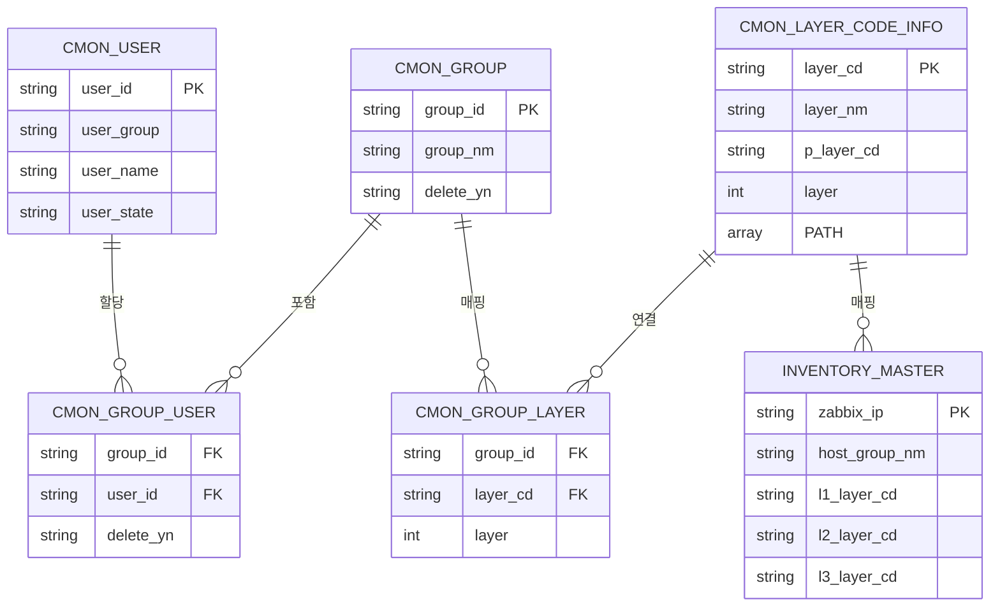
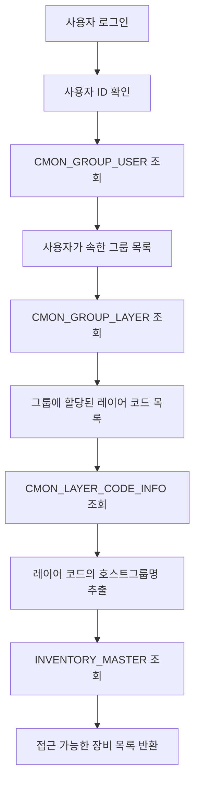
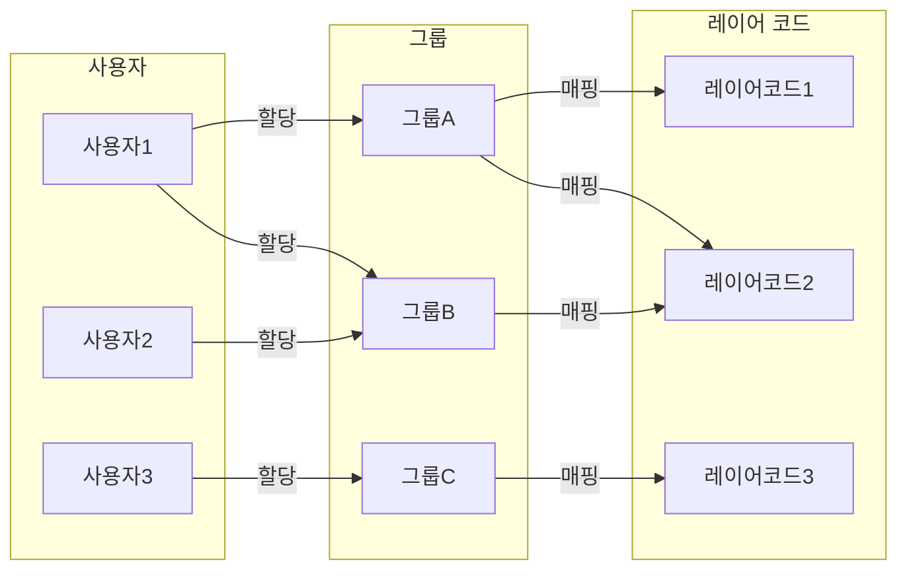
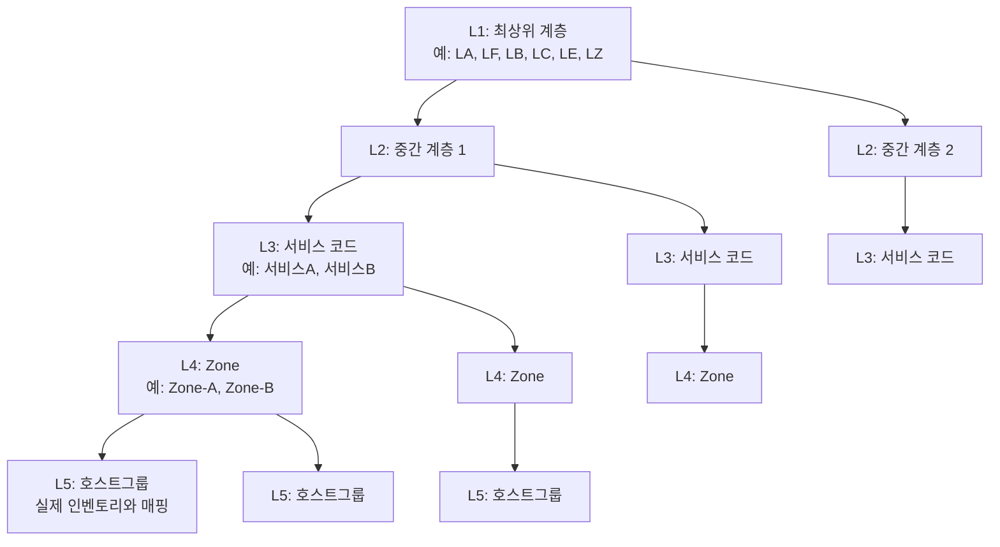
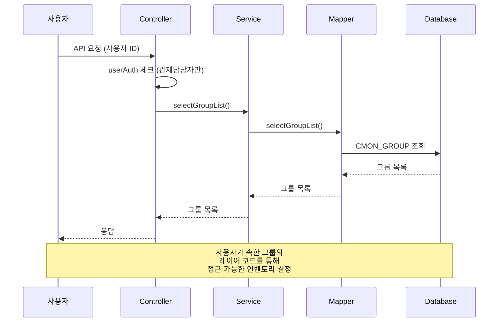

# Luppiter Web 권한 체계 문서

## 목차
1. [개요](#개요)
2. [핵심 테이블 구조](#핵심-테이블-구조)
3. [테이블 관계도](#테이블-관계도)
4. [권한 체계 흐름](#권한-체계-흐름)
5. [사용자 묶임 방식](#사용자-묶임-방식)
6. [레이어 계층 구조](#레이어-계층-구조)
7. [관리 기능](#관리-기능)
8. [코드 구조](#코드-구조)
9. [권한 확인 프로세스](#권한-확인-프로세스)

---

## 개요

Luppiter Web의 권한 체계는 **그룹 기반 접근 제어(Group-Based Access Control)** 방식을 사용합니다. 사용자는 그룹에 할당되고, 그룹은 레이어 코드(설비 계층 구조)에 매핑되어 최종적으로 인벤토리(장비)에 대한 접근 권한을 부여합니다.

### 핵심 개념
- **사용자(User)**: 시스템을 사용하는 개인
- **그룹(Group)**: 권한을 묶어서 관리하는 단위
- **레이어 코드(Layer Code)**: 5단계 계층 구조로 구성된 설비 분류 체계
- **인벤토리(Inventory)**: 실제 모니터링 대상 장비

---

## 핵심 테이블 구조

### 1. cmon_user (사용자)
```sql
- user_id (PK): 사용자 ID
- user_password: 비밀번호
- user_group: 사용자 그룹 (관제담당자/관제자/사용자/운영담당자/승인대기)
- user_name: 사용자 이름
- user_depart: 소속 부서
- user_state: 사용자 상태 (0:사용, 1:미사용, 9:승인대기)
- last_login: 마지막 로그인 시간
```

### 2. cmon_group (설비권한그룹)
```sql
- group_id (PK): 그룹 ID (형식: G0001, G0002, ...)
- group_nm: 그룹명
- delete_yn: 삭제 여부 (N:활성, Y:삭제)
- cret_dt: 생성일시
- cretr_id: 생성자 ID
- amd_dt: 수정일시
- amdr_id: 수정자 ID
```

### 3. cmon_group_user (그룹-사용자 매핑)
```sql
- group_id (FK): 그룹 ID
- user_id (FK): 사용자 ID
- delete_yn: 삭제 여부
- cret_dt: 생성일시
- cretr_id: 생성자 ID
- amd_dt: 수정일시
- amdr_id: 수정자 ID
```

### 4. cmon_group_layer (그룹-레이어 매핑)
```sql
- group_id (FK): 그룹 ID
- layer_cd (FK): 레이어 코드
- layer: 레이어 레벨 (보통 5)
- cret_dt: 생성일시
- cretr_id: 생성자 ID
- amd_dt: 수정일시
- amdr_id: 수정자 ID
```

### 5. cmon_layer_code_info (레이어 코드 정보)
```sql
- layer_cd (PK): 레이어 코드
- layer_nm: 레이어명
- p_layer_cd: 부모 레이어 코드
- layer: 레이어 레벨 (1~5)
- delete_yn: 삭제 여부
- PATH: 계층 경로 배열 (예: ['LA', 'LA01', 'LA0101', 'LA010101', 'LA01010101'])
```

### 6. inventory_master (인벤토리)
```sql
- zabbix_ip (PK): 장비 IP
- host_nm: 호스트명
- host_group_nm: 호스트그룹명 (레이어 L5와 매핑)
- l1_layer_cd: L1 레이어 코드
- l2_layer_cd: L2 레이어 코드
- l3_layer_cd: L3 레이어 코드
- zone: Zone 정보 (L4)
- control_area: 제어 영역
```

---

## 테이블 관계도



---

## 권한 체계 흐름



### 상세 흐름 설명

1. **사용자 인증**: `cmon_user` 테이블에서 사용자 정보 확인
2. **그룹 조회**: `cmon_group_user`에서 사용자가 속한 모든 그룹 조회
3. **레이어 코드 조회**: 각 그룹의 `cmon_group_layer`에서 레이어 코드 조회
4. **호스트그룹명 매핑**: `cmon_layer_code_info`에서 레이어 코드의 `layer_nm` (호스트그룹명) 추출
5. **인벤토리 필터링**: `inventory_master`에서 해당 호스트그룹명과 일치하는 장비만 조회

---

## 사용자 묶임 방식

### 다대다 관계 구조



### 관계 특징

- **사용자 ↔ 그룹**: 다대다 관계
  - 한 사용자는 여러 그룹에 속할 수 있음
  - 한 그룹에는 여러 사용자가 속할 수 있음
  
- **그룹 ↔ 레이어 코드**: 다대다 관계
  - 한 그룹은 여러 레이어 코드에 매핑될 수 있음
  - 한 레이어 코드는 여러 그룹에 할당될 수 있음

- **최종 권한**: 사용자가 속한 모든 그룹의 레이어 코드를 합집합하여 접근 권한 결정

---

## 레이어 계층 구조

### 5단계 계층 구조



### 레이어 코드 예시

```
PATH 배열: ['LA', 'LA01', 'LA0101', 'LA010101', 'LA01010101']

LA (L1) - 최상위
  └─ LA01 (L2) - 중간 계층
      └─ LA0101 (L3) - 서비스 코드
          └─ LA010101 (L4) - Zone
              └─ LA01010101 (L5) - 호스트그룹명
                  └─ inventory_master.host_group_nm과 매핑
```

### 계층 구조 특징

- **재귀적 구조**: `p_layer_cd`로 부모-자식 관계 표현
- **PATH 배열**: 전체 계층 경로를 배열로 저장하여 빠른 조회 가능
- **L5 레벨만 권한 할당**: 실제 권한은 L5(호스트그룹) 레벨에만 할당
- **상위 레이어 조회**: 상위 레이어 코드로 하위 레이어를 재귀적으로 조회 가능

---

## 관리 기능

### 1. 그룹 관리

#### 그룹 등록
```java
// API: POST /api/ctl/insertGroup
// 권한: 관제담당자만 가능
// 기능: 새 그룹 생성 (group_id 자동 생성: G0001, G0002, ...)
```

#### 그룹 수정
```java
// API: POST /api/ctl/updateGroup
// 권한: 관제담당자만 가능
// 기능: 그룹명 변경
```

#### 그룹 삭제
```java
// API: POST /api/ctl/deleteGroup
// 권한: 관제담당자만 가능
// 기능: 
// 1. 그룹 Soft Delete (delete_yn = 'Y')
// 2. 연관된 그룹 사용자도 Soft Delete
```

### 2. 사용자 할당 관리

#### 사용자 등록
```java
// API: POST /api/ctl/insertGroupUser
// 권한: 관제담당자만 가능
// 기능: 
// 1. 그룹에 여러 사용자 한 번에 등록
// 2. 이력 테이블(cmon_group_user_history)에 추가 이력 저장
```

#### 사용자 삭제
```java
// API: POST /api/ctl/deleteGroupUser
// 권한: 관제담당자만 가능
// 기능:
// 1. 그룹에서 사용자 Soft Delete
// 2. 이력 테이블에 삭제 이력 저장
```

### 3. 레이어 코드 할당 관리

#### 레이어 코드 저장
```java
// API: POST /api/ctl/saveLayerCode
// 권한: 관제담당자만 가능
// 기능:
// 1. 기존 레이어 코드 매핑 삭제
// 2. 새 레이어 코드 매핑 등록
// 3. 이력 테이블(cmon_group_layer_history)에 변경 이력 저장
```

### 4. 권한 체크

```java
// 모든 그룹 관련 API는 userAuth 체크
switch (userAuthCheck) {
    case "관제담당자":
        // 허용
        break;
    case "관제자":
    case "사용자":
    case "운영담당자":
    default:
        throw new Exception("userAuthCheck exception");
}
```

---

## 코드 구조

### Controller 계층

```java
// 파일: CtlRestController.java
@RequestMapping(value="/api/ctl/groupList", method=RequestMethod.POST)
public Map<String, Object> groupList(...) {
    // 설비권한그룹 목록 조회
}

@RequestMapping(value="/api/ctl/insertGroup", method=RequestMethod.POST)
public Map<String, Object> insertGroup(...) {
    // 설비권한그룹 등록
}

@RequestMapping(value="/api/ctl/groupUserList", method=RequestMethod.POST)
public Map<String, Object> groupUserList(...) {
    // 그룹에 속한 사용자 목록 조회
}
```

### Service 계층

```java
// 파일: CtlServiceImpl.java
@Override
public int deleteGroup(Map<String, Object> map) throws Exception {
    int delCnt = 0;
    delCnt = ctlMapper.deleteGroup(map);        // 그룹 삭제
    ctlMapper.deleteGroupUserForGroup(map);    // 그룹사용자 삭제
    return delCnt;
}

@Override
public int saveLayerCode(Map<String, Object> map) throws Exception {
    // 해당 그룹ID 데이터 삭제 후 저장
    ctlMapper.deleteGroupLayer(map);
    
    int intCnt = 0;
    intCnt = ctlMapper.saveLayerCode(map);      // 그룹-레이어코드 매핑 INSERT
    
    if(intCnt > 0) {
        ctlMapper.saveLayerCodeHistory(map);    // 이력 테이블 INSERT
    }
    
    return intCnt;
}
```

### Mapper 계층

```xml
<!-- 파일: sql-ctl.xml -->
<select id="selectGroupList" ...>
    SELECT 
        cg.group_id,
        cg.group_nm,
        count(cgl.group_id) AS group_count
    FROM cmon_group cg
    LEFT JOIN cmon_group_layer cgl
        ON (cg.group_id = cgl.group_id)
    WHERE cg.delete_yn = 'N'
    GROUP BY cg.group_id
</select>
```

---

## 권한 확인 프로세스

### 실제 권한 확인 쿼리

```sql
-- 사용자가 접근 가능한 인벤토리 조회
SELECT 
    E.ZABBIX_IP,
    E.HOST_NM,
    E.HOST_GROUP_NM,
    E.CONTROL_AREA
FROM CMON_GROUP_USER A
INNER JOIN CMON_GROUP B 
    ON A.GROUP_ID = B.GROUP_ID 
    AND B.DELETE_YN = 'N'
INNER JOIN CMON_GROUP_LAYER C 
    ON A.GROUP_ID = C.GROUP_ID 
    AND C.LAYER = 5
INNER JOIN CMON_LAYER_CODE_INFO D 
    ON C.LAYER_CD = D.LAYER_CD
INNER JOIN INVENTORY_MASTER E 
    ON D.LAYER_NM = E.HOST_GROUP_NM
WHERE A.USER_ID = #{loginUserId} 
    AND A.DELETE_YN = 'N'
```

### 권한 확인 시퀀스



### 권한 적용 예시

**시나리오**: 사용자 "user001"이 접근 가능한 장비 조회

1. **그룹 조회**
   ```
   user001 → 그룹A, 그룹B
   ```

2. **레이어 코드 조회**
   ```
   그룹A → 레이어코드1, 레이어코드2
   그룹B → 레이어코드2, 레이어코드3
   ```

3. **호스트그룹명 추출**
   ```
   레이어코드1 → 호스트그룹A
   레이어코드2 → 호스트그룹B
   레이어코드3 → 호스트그룹C
   ```

4. **인벤토리 필터링**
   ```
   호스트그룹A, 호스트그룹B, 호스트그룹C에 속한 모든 장비
   ```

---

## 주요 특징

### 1. 유연한 권한 관리
- 그룹 단위로 권한을 묶어서 관리하므로 사용자별 개별 권한 설정보다 효율적
- 한 사용자가 여러 그룹에 속할 수 있어 다양한 권한 조합 가능

### 2. 계층적 설비 구조
- 5단계 계층 구조로 설비를 체계적으로 분류
- 상위 레이어에서 하위 레이어를 재귀적으로 조회 가능

### 3. 이력 관리
- 그룹-사용자 할당 이력: `cmon_group_user_history`
- 그룹-레이어코드 할당 이력: `cmon_group_layer_history`
- 모든 변경 사항을 추적 가능

### 4. Soft Delete
- 물리적 삭제 대신 `delete_yn` 플래그로 논리적 삭제
- 데이터 복구 및 이력 추적 용이

### 5. 권한 격리
- API 레벨에서 권한 체크 (관제담당자만 그룹 관리 가능)
- 사용자는 자신이 속한 그룹의 권한 범위 내에서만 데이터 접근

---

## 참고 파일

- **Controller**: `src/main/java/com/framework/ctl/controller/CtlRestController.java`
- **Service**: `src/main/java/com/framework/ctl/service/CtlServiceImpl.java`
- **Mapper**: `src/main/resources/mapper/sql-ctl.xml`
- **JSP**: `src/main/webapp/WEB-INF/jsp/ctl/subControlGroup.jsp`

---

## 변경 이력

| 날짜 | 변경 내용 | 작성자 |
|------|----------|--------|
| 2024-XX-XX | 초안 작성 | - |


